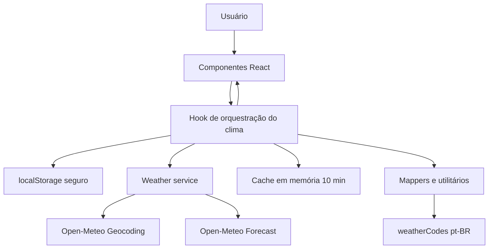
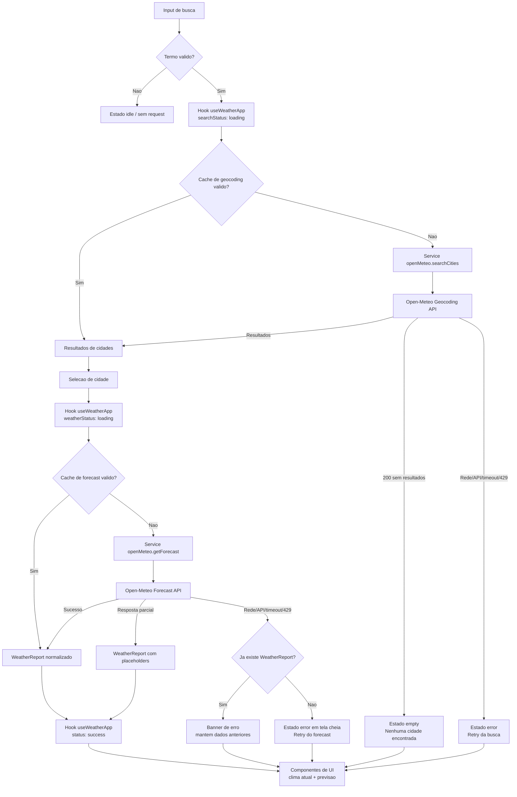

# Weather App - Plano Técnico

> Fonte da verdade: [specs/weather-app-spec.md](../specs/weather-app-spec.md). Este plano traduz a especificação aprovada em decisões técnicas e contratos para orientar Tasks -> Code -> Test, sem implementar código final.

## Architecture

A aplicação será uma SPA React executada totalmente no cliente, organizada em camadas simples para separar apresentação, estado e acesso a dados.



Decisões principais:

- UI em componentes pequenos: busca, lista de cidades, clima atual, previsão, seletor de unidade, estados de feedback e banner de erro.
- Orquestração em um hook dedicado para centralizar busca, seleção de cidade, retry, persistência e conversão de unidade.
- Acesso remoto isolado em `src/services/`, com timeout de 10 s, validação mínima de resposta e tratamento uniforme de erros.
- API sempre consultada em Celsius; Fahrenheit será conversão local de apresentação para cumprir RF5/AC5.2.
- Cache em memória, não persistido, com TTL de 10 minutos para geocoding e forecast, conforme NFR7.
- Mapeamento de `weather_code` em `src/lib/weatherCodes.ts`, com rótulos pt-BR e ícones Unicode simples, conforme decisão da spec.

Rastreabilidade: RF1, RF2, RF3, RF4, RF5, RF6, RF7; NFR1, NFR3, NFR4, NFR7, NFR8, NFR10.

## Tech Stack

- TypeScript strict: contratos explícitos para respostas da API, modelos normalizados e estados da UI.
- React + Vite: SPA simples, rápida e adequada ao escopo sem backend.
- Tailwind CSS: tema dark glassmorphism já definido pelo projeto, com responsividade em 768px.
- Vitest + Testing Library: testes unitários e de integração leve para hooks, services, conversão, renderização e estados.
- Playwright: validação E2E dos fluxos críticos de busca, seleção, persistência, erro e responsividade.
- Biome: lint e formatação conforme stack do repositório.
- Open-Meteo: geocoding e forecast sem API key, compatível com a exigência de aplicação gratuita e client-side.

Não serão adicionadas bibliotecas de estado global ou data fetching nesta versão. O escopo é pequeno o suficiente para `useState`, `useEffect` e helpers locais, mantendo simplicidade e testabilidade.

## Project Structure

Estrutura esperada para a implementação:

```text
src/
  App.tsx
  main.tsx
  index.css
  components/
    SearchForm.tsx
    CityResults.tsx
    UnitToggle.tsx
    CurrentWeatherCard.tsx
    ForecastList.tsx
    FeedbackState.tsx
    ErrorBanner.tsx
  hooks/
    useWeatherApp.ts
  lib/
    temperature.ts
    weatherCodes.ts
    storage.ts
    cache.ts
  services/
    openMeteo.ts
  types/
    weather.ts
```

Responsabilidades:

- `components/`: apenas apresentação, eventos de UI e acessibilidade. Não chamam APIs diretamente.
- `hooks/`: estado da tela, fluxo de operações, retry e integração com serviços/storage.
- `services/`: chamadas HTTP, timeout, normalização básica e erros tipados.
- `lib/`: funções puras para conversão, cache, storage resiliente e mapeamento de códigos WMO.
- `types/`: contratos compartilhados entre service, hook e UI.

## Data Model

Contratos planejados, sujeitos a refinamento durante a implementação, mas suficientes para orientar tarefas e testes.

```ts
export type TemperatureUnit = 'celsius' | 'fahrenheit';

export type RequestStatus = 'idle' | 'loading' | 'success' | 'empty' | 'error';

export interface City {
  id: number;
  name: string;
  country: string;
  admin1?: string;
  latitude: number;
  longitude: number;
  timezone?: string;
}

export interface WeatherCondition {
  code?: number;
  label: string;
  icon: string;
}

export interface CurrentWeather {
  temperatureCelsius?: number;
  apparentTemperatureCelsius?: number;
  relativeHumidity?: number;
  windSpeedKmh?: number;
  condition: WeatherCondition;
}

export interface DailyForecast {
  date: string;
  minTemperatureCelsius?: number;
  maxTemperatureCelsius?: number;
  condition: WeatherCondition;
}

export interface WeatherReport {
  city: City;
  current: CurrentWeather;
  daily: DailyForecast[];
  fetchedAt: number;
}

export type WeatherOperation =
  | { type: 'search'; query: string }
  | { type: 'forecast'; city: City };

export interface AppError {
  kind: 'network' | 'timeout' | 'rate-limit' | 'api' | 'invalid-data' | 'storage';
  message: string;
  operation: WeatherOperation;
}

export interface WeatherAppState {
  unit: TemperatureUnit;
  searchQuery: string;
  searchStatus: RequestStatus;
  weatherStatus: RequestStatus;
  results: City[];
  activeCity?: City;
  report?: WeatherReport;
  error?: AppError;
  lastFailedOperation?: WeatherOperation;
}
```

Regras de modelagem:

- Temperaturas armazenadas internamente em Celsius para evitar perda de precisão e cumprir AC5.2.
- Valores ausentes ou nulos da API permanecem opcionais no modelo; a UI exibe `—` para números ausentes.
- `daily` deve conter no máximo 5 itens: hoje + 4 dias, usando diretamente `daily.weather_code` da API.
- `WeatherCondition` usa fallback `Condição desconhecida` e ícone `❓` quando o código estiver ausente ou não mapeado.

## Data Flow



Fluxo de busca de cidades:

1. Usuário digita um termo e confirma por Enter ou botão.
2. `SearchForm` ignora termos vazios ou apenas com espaços, sem loading e sem request.
3. `useWeatherApp` registra a operação `{ type: 'search', query }`, muda `searchStatus` para `loading` e consulta o cache.
4. Em cache hit válido, resultados são retornados sem rede.
5. Em cache miss, `openMeteo.searchCities(query)` chama geocoding com timeout de 10 s.
6. Resposta 200 sem resultados gera `searchStatus: 'empty'` e mensagem de vazio.
7. Resposta com resultados normaliza `City[]` e renderiza lista com nome, país e `admin1` quando presente.
8. Falha de rede/API/timeout gera `AppError` e habilita retry da mesma busca.

Fluxo de seleção e previsão:

1. Usuário seleciona uma cidade por clique ou Enter com item focado.
2. `useWeatherApp` define `activeCity`, registra `{ type: 'forecast', city }` e muda `weatherStatus` para `loading`.
3. Service consulta cache por coordenadas; se necessário, chama forecast da Open-Meteo.
4. Resposta é normalizada para `WeatherReport`, incluindo current e exatamente 5 dias de daily forecast.
5. Cidade selecionada e unidade são persistidas em `localStorage` após sucesso da seleção.
6. UI renderiza clima atual e previsão; alternância de unidade apenas recalcula valores exibidos.

Fluxo de restauração:

1. Na inicialização, storage seguro tenta ler unidade e última cidade selecionada.
2. Unidade inválida cai para Celsius.
3. Cidade válida dispara automaticamente operação de forecast.
4. Se a restauração falhar, o app mostra erro sem travar e mantém a busca disponível.

## External APIs

### Geocoding

Endpoint:

```text
GET https://geocoding-api.open-meteo.com/v1/search
```

Parâmetros planejados:

- `name`: termo informado pelo usuário, com URL encoding.
- `count`: limite simples, por exemplo `10`, para evitar listas excessivas.
- `language=pt`: preferência de localização quando suportada.
- `format=json`.

Campos consumidos:

- `id`
- `name`
- `country`
- `admin1`
- `latitude`
- `longitude`
- `timezone`

Exemplo resumido de resposta:

```json
{
  "results": [
    {
      "id": 3448439,
      "name": "São Paulo",
      "latitude": -23.5475,
      "longitude": -46.6361,
      "country": "Brasil",
      "admin1": "São Paulo",
      "timezone": "America/Sao_Paulo"
    }
  ]
}
```

Mapeamento para `City`:

```ts
{
  id: result.id,
  name: result.name,
  country: result.country,
  admin1: result.admin1,
  latitude: result.latitude,
  longitude: result.longitude,
  timezone: result.timezone,
}
```

Campos mínimos para um item válido: `id`, `name`, `country`, `latitude` e `longitude`. `admin1` e `timezone` são opcionais.

Regras:

- HTTP não-2xx vira erro `api`, exceto 429 que vira `rate-limit`.
- Ausência de `results` ou array vazio em 200 OK vira estado vazio, não erro.
- Dados mínimos inválidos em itens individuais podem ser descartados; se nenhum item válido sobrar, exibir vazio.

### Forecast

Endpoint:

```text
GET https://api.open-meteo.com/v1/forecast
```

Parâmetros planejados:

- `latitude`
- `longitude`
- `current=temperature_2m,relative_humidity_2m,apparent_temperature,weather_code,wind_speed_10m`
- `daily=weather_code,temperature_2m_max,temperature_2m_min`
- `forecast_days=5`
- `temperature_unit=celsius`
- `wind_speed_unit=kmh`
- `timezone=auto`

Campos consumidos:

- `current.temperature_2m`
- `current.apparent_temperature`
- `current.relative_humidity_2m`
- `current.wind_speed_10m`
- `current.weather_code`
- `daily.time`
- `daily.temperature_2m_min`
- `daily.temperature_2m_max`
- `daily.weather_code`

Exemplo resumido de resposta:

```json
{
  "latitude": -23.5,
  "longitude": -46.625,
  "timezone": "America/Sao_Paulo",
  "current": {
    "time": "2026-09-03T12:00",
    "temperature_2m": 24.6,
    "relative_humidity_2m": 61,
    "apparent_temperature": 25.1,
    "weather_code": 2,
    "wind_speed_10m": 12.4
  },
  "daily": {
    "time": ["2026-09-03", "2026-09-04", "2026-09-05", "2026-09-06", "2026-09-07"],
    "weather_code": [2, 3, 61, 80, 1],
    "temperature_2m_max": [28.2, 27.5, 24.1, 23.8, 29.0],
    "temperature_2m_min": [18.4, 17.9, 16.8, 16.1, 19.2]
  }
}
```

Mapeamento para `CurrentWeather`:

```ts
{
  temperatureCelsius: response.current?.temperature_2m,
  apparentTemperatureCelsius: response.current?.apparent_temperature,
  relativeHumidity: response.current?.relative_humidity_2m,
  windSpeedKmh: response.current?.wind_speed_10m,
  condition: getWeatherCondition(response.current?.weather_code),
}
```

Mapeamento para `DailyForecast[]`:

```ts
response.daily.time.slice(0, 5).map((date, index) => ({
  date,
  minTemperatureCelsius: response.daily.temperature_2m_min?.[index],
  maxTemperatureCelsius: response.daily.temperature_2m_max?.[index],
  condition: getWeatherCondition(response.daily.weather_code?.[index]),
}))
```

Mapeamento para `WeatherReport`:

```ts
{
  city,
  current,
  daily,
  fetchedAt: Date.now(),
}
```

Regras:

- Forecast sempre retorna base Celsius; Fahrenheit é derivado na UI.
- Se campos parciais estiverem ausentes, renderizar o disponível e usar placeholders.
- Se `daily` tiver mais de 5 itens, limitar a 5; se vier com menos, renderizar os disponíveis sem quebrar.

## State Management

Estado local no hook `useWeatherApp` será suficiente para o v1. O hook é a fronteira de orquestração: recebe eventos dos componentes, chama serviços, consulta cache/storage e devolve para a UI um estado já normalizado.

Estado mantido:

- `unit`: unidade atual, padrão Celsius, persistida em `localStorage`.
- `searchQuery`: texto controlado do campo de busca.
- `results`: cidades retornadas pela última busca bem-sucedida.
- `activeCity`: cidade selecionada atualmente.
- `report`: clima atual e previsão normalizados.
- `searchStatus` e `weatherStatus`: status separados para busca e carregamento de clima.
- `error`: erro atual exibível.
- `lastFailedOperation`: operação usada pelo botão "tentar novamente".

Estados explícitos:

- `idle`: estado inicial antes de qualquer operação, ou estado neutro de uma área que não está carregando nem exibindo resultado.
- `loading`: há uma request de geocoding ou forecast em andamento; a UI deve exibir feedback acessível.
- `success`: a operação terminou com dados válidos; em busca, há `results`; em forecast, há `report`.
- `empty`: a busca retornou 200 OK sem resultados válidos; não é usado para falha de rede/API.
- `error`: a operação falhou por rede, timeout, HTTP não-2xx, 429 ou dados mínimos inválidos.

Transições principais:

- Busca vazia: mantém `searchStatus` como `idle` e não dispara request.
- Busca válida: `idle|success|empty|error -> loading -> success|empty|error`.
- Seleção de cidade: `weatherStatus -> loading -> success|error`.
- Retry: reexecuta `lastFailedOperation` e aplica as mesmas transições da operação original.
- Erro com `report` existente: `weatherStatus` pode virar `error`, mas `report` permanece preservado para a UI mostrar banner sobre os dados antigos.

Conversão de unidade:

- O service sempre solicita `temperature_unit=celsius` e o modelo interno armazena temperaturas em Celsius.
- A alternância altera apenas `unit`; não altera `report`, `activeCity`, `results` nem cache.
- Componentes derivam valores exibidos durante a renderização por uma função pura, por exemplo `formatTemperature(valueInCelsius, unit)`.
- `formatTemperature` converte para Fahrenheit com `(valueInCelsius * 9) / 5 + 32` quando necessário e arredonda com `Math.round` para cumprir AC5.4.
- Valores ausentes não são convertidos; a UI exibe `—`.
- Como a conversão é derivada do estado já carregado, o toggle não dispara `openMeteo` nem invalida cache.

Persistência:

- Chaves sugeridas: `weather-app:unit` e `weather-app:last-city`.
- Leitura deve ser resiliente a `localStorage` indisponível, JSON corrompido ou dados inválidos.
- Escrita deve falhar silenciosamente, mantendo o app funcional sem persistência.

Cache:

- Cache em memória com TTL de 10 minutos.
- Chave de geocoding: termo normalizado com `trim()` e lowercase preservando caracteres codificados na request.
- Chave de forecast: coordenadas arredondadas de forma estável, por exemplo `${latitude},${longitude}`.
- Cache não substitui tratamento de loading, erro e retry; apenas evita requests repetidas dentro do TTL.

## Error Handling

Estratégia geral:

- Toda request usa timeout de 10 s via `AbortController`.
- Erros são normalizados em `AppError` com `kind`, mensagem pt-BR e operação original.
- Botão "tentar novamente" executa `lastFailedOperation` sem alterar seus parâmetros.
- Submit repetido deve ser bloqueado enquanto a busca estiver em loading.
- HTTP 429 recebe mensagem específica, orientando tentar novamente em instantes.

Categorias de erro:

- Rede: falhas de `fetch`, perda de conexão ou request abortada por erro externo viram `kind: 'network'` e mostram mensagem amigável com retry.
- API: HTTP não-2xx vira `kind: 'api'`; HTTP 429 vira `kind: 'rate-limit'` para orientar o usuário a tentar novamente em instantes.
- Timeout: requests que ultrapassarem 10 s são abortadas e viram `kind: 'timeout'`, seguindo o mesmo fluxo visual de erro com retry.
- Resposta parcial: campos opcionais ausentes não quebram a tela; campos numéricos exibem `—` e `weather_code` ausente/desconhecido usa fallback de condição.
- Dados mínimos inválidos: se uma resposta não tiver campos suficientes para montar `City` ou `WeatherReport`, registrar `kind: 'invalid-data'` e tratar como erro da operação.
- Storage: falhas de leitura/escrita ou JSON corrompido não bloqueiam o app; preferências inválidas são ignoradas e a aplicação usa os padrões.

Estados da UI:

- Inicial/vazio sem cidade persistida: orientar o usuário a buscar uma cidade.
- Busca sem resultados: mensagem "Nenhuma cidade encontrada" e nenhuma lista.
- Loading: indicador acessível com `role="status"` ou texto equivalente.
- Erro na primeira carga ou sem dados anteriores: estado de erro em tela cheia com retry.
- Erro ao atualizar cidade já exibida: manter `report` visível e exibir banner de erro sobreposto.

Tratamento de dados parciais:

- Campos numéricos ausentes: placeholder `—`.
- Código WMO ausente/desconhecido: `Condição desconhecida` + `❓`.
- Respostas com itens inválidos: descartar item inválido quando possível; erro `invalid-data` apenas quando não houver dados suficientes para montar a tela mínima.

## Testing Strategy

Objetivo: cobrir regras pequenas com testes baratos, fluxos de estado com Testing Library e somente os caminhos críticos de usuário com Playwright. Isso mantém feedback rápido sem perder confiança nos requisitos da spec.

Vitest - funções puras:

- `temperature.ts`: conversão Celsius/Fahrenheit e arredondamento, cobrindo 0, 100, -40 e 20.5 °C.
- `weatherCodes.ts`: mapeamento de códigos WMO conhecidos e fallback desconhecido.
- `storage.ts`: unidade padrão Celsius, restauração válida, JSON inválido e storage indisponível.
- `cache.ts`: hit, miss e expiração por TTL de 10 minutos.
- Formatadores de exibição: placeholder `—` para valores ausentes e unidade correta no texto renderizado.

Vitest - services com mock de `fetch`:

- `openMeteo.searchCities`: monta a URL correta, codifica acentos/caracteres especiais, envia `name`, `count`, `language` e `format`.
- `openMeteo.searchCities`: diferencia 200 OK sem `results` de falha de rede/API.
- `openMeteo.getForecast`: monta `current`, `daily`, `forecast_days=5`, `temperature_unit=celsius`, `wind_speed_unit=kmh` e `timezone=auto`.
- Tratamento de HTTP não-2xx, 429/rate limit, timeout via `AbortController` e rejeição de `fetch`.
- Normalização de resposta parcial: campos opcionais ausentes não lançam erro; dados mínimos inválidos geram `invalid-data`.

Vitest + Testing Library - hooks e componentes:

- Busca válida dispara geocoding e renderiza resultados com país/admin1 quando presente.
- Input vazio não dispara request nem loading.
- Lista de resultados permite navegação por setas e seleção por Enter.
- Clima atual mostra temperatura, sensação, umidade, vento e condição.
- Previsão renderiza exatamente 5 dias quando disponíveis.
- Toggle de unidade atualiza todos os valores sem chamar service novamente.
- Erro com dados anteriores mantém a tela e mostra banner.
- Retry repete a última operação com os mesmos parâmetros.
- `FeedbackState`: cobre `idle`, `loading`, `empty`, `error` e `success`, incluindo loading com `role="status"`.
- Componentes de apresentação: validam renderização de sucesso, vazio, erro e dados parciais sem depender da Open-Meteo real.

Playwright - fluxos E2E:

- Fluxo completo: buscar cidade, escolher resultado homônimo, ver clima atual e previsão.
- Persistência: recarregar página e restaurar unidade + última cidade.
- Falha de geocoding: exibir erro e retry.
- Geocoding sem resultados: exibir estado vazio.
- Falha de forecast após dados existentes: manter dados e mostrar banner.
- Alternância de unidade: valores mudam na tela sem nova chamada de forecast.
- Acessibilidade básica: navegação por teclado, foco visível e loading com `role="status"`.

Playwright - viewport mobile:

- Rodar pelo menos um fluxo feliz e um fluxo de erro em viewport mobile abaixo de 768px.
- Validar que campo de busca, lista de cidades, cards de clima e botão de retry continuam utilizáveis por toque.
- Conferir que não há sobreposição de conteúdo em estado loading, vazio, erro e sucesso.
- Manter um projeto desktop e um projeto mobile no `playwright.config.ts`, evitando duplicar todos os cenários em ambos.

Validações antes de concluir tarefas de implementação:

- `pnpm lint`
- `pnpm build`
- `pnpm test`

## Risks & Trade-offs

| Risco/decisão | Impacto | Alternativa considerada | Mitigação ou justificativa |
| --- | --- | --- |
| Dependência da Open-Meteo | Indisponibilidade ou mudança de contrato pode afetar o app | Backend próprio como proxy/normalizador | Isolar em `services/`, normalizar erros, usar retry e cache curto; backend está fora do escopo v1 |
| Cidades homônimas | Usuário pode escolher local errado | Carregar automaticamente o primeiro resultado | Exibir país e `admin1`, exigir seleção explícita antes do forecast |
| Sem biblioteca de data fetching | Menos recursos prontos de cache/retry | TanStack Query ou SWR | Escopo pequeno; cache TTL e retry manual são suficientes para v1 |
| Cache em memória | Dados somem ao recarregar a página | Persistir cache em `localStorage` ou IndexedDB | Aceito pela spec; persistência é apenas de unidade e última cidade |
| Forecast parcial | Layout pode quebrar se API omitir campos | Rejeitar qualquer resposta incompleta | Modelo com campos opcionais e placeholders preserva a experiência |
| Conversão local de unidade | Possível divergência se API tivesse regras próprias | Fazer nova request com `temperature_unit=fahrenheit` | Cumpre AC5.2, evita rede e mantém toggle instantâneo; testes cobrem arredondamento |
| `localStorage` indisponível | Preferências podem não persistir | Exigir storage disponível antes de iniciar | Storage resiliente com fallback para estado inicial mantém o app funcional |
| Rate limiting 429 | Usuário pode ficar bloqueado temporariamente | Debounce/autocomplete enquanto digita | Cache de 10 min, bloqueio de submits repetidos e mensagem específica; autocomplete está fora do escopo |
| Acessibilidade da lista customizada | Teclado e foco podem regredir | Usar componente pronto de combobox | Lista simples com setas/Enter é suficiente porque não há autocomplete; testes cobrem foco e teclado |
| Testes E2E em excesso | Pipeline mais lento e frágil | Cobrir tudo via Playwright | Deixar regras puras e services no Vitest; Playwright fica nos fluxos críticos e viewport mobile |
| Over-engineering | Mais complexidade que o treinamento precisa | Estado global externo, PWA, favoritos, geolocalização | Evitar recursos fora de escopo e manter camadas pequenas e testáveis |
